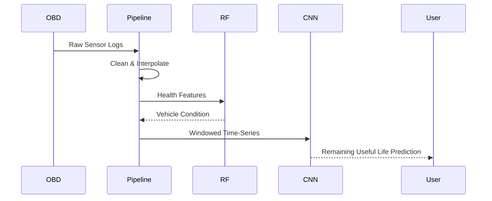

# Remaining Useful Life Prediction using OBD-II Vehicle Sensor Data


> An end-to-end predictive maintenance pipeline that estimates the Remaining Useful Life (RUL) of vehicles using OBD-II sensor data through automated preprocessing, health-state classification, and deep learning-based regression.

---

# Overview

This university project investigates predictive maintenance using real-world OBD-II vehicle telemetry. The pipeline processes raw sensor logs, cleans and interpolates missing values, generates health labels, classifies vehicle condition, and predicts Remaining Useful Life (RUL) using a Convolutional Neural Network (CNN).

Unlike a standalone regression model, the project implements a complete workflow beginning with raw diagnostic data and ending with RUL estimation, making it representative of an automotive machine learning pipeline.

---

# Motivation

Unexpected vehicle failures increase maintenance costs and reduce reliability. Predictive maintenance attempts to identify degradation before failures occur.

This project explores how machine learning can leverage OBD-II sensor data to estimate vehicle health and remaining service life, enabling proactive maintenance decisions.

---

# Features

| Feature | Description |
|---------|-------------|
| Automatic Dataset Acquisition | Downloads the required OBD-II dataset from Kaggle |
| Data Cleaning | Handles missing values using interpolation |
| Feature Engineering | Extracts usable features from raw sensor logs |
| Health Label Generation | Automatically derives health categories from sensor statistics |
| Health Classification | Random Forest classifier predicts vehicle condition |
| Time-Series Windowing | Converts sequential sensor readings into model inputs |
| CNN Regression | Predicts Remaining Useful Life |
| Performance Evaluation | Reports classification and regression metrics |
| Visualization | Displays training history and prediction results |

---

# System Architecture

```mermaid
flowchart LR
A[Raw OBD-II Logs]
-->B[Preprocessing]

B-->C[Interpolation]

C-->D[Feature Engineering]

D-->E[Health Label Generation]

E-->F[Random Forest Classifier]

F-->G[Vehicle Health State]

G-->H[Sliding Window Generator]

H-->I[CNN RUL Predictor]

I-->J[Remaining Useful Life]
```



---

# End-to-End Workflow



---

# Repository Structure

```text
.
├── main.py
├── README.md
└── LICENSE
```

---

# Technology Stack

| Layer | Technology |
|------|------------|
| Language | Python |
| Deep Learning | TensorFlow / Keras |
| Machine Learning | Scikit-learn |
| Data Processing | Pandas, NumPy |
| Visualization | Matplotlib |
| Dataset | Kaggle OBD-II Vehicle Dataset |

---

# Installation

```bash
git clone <repository-url>
cd Remaining-Useful-Life-Prediction-using-OBD-II-Vehicle-Sensor-Data

pip install tensorflow scikit-learn pandas numpy matplotlib kaggle
```

Run:

```bash
python main.py
```

---

# Pipeline

1. Download the OBD-II dataset.
2. Load multiple CSV driving sessions.
3. Clean and interpolate missing values.
4. Generate health labels using percentile-based thresholds.
5. Train a Random Forest classifier to identify vehicle health.
6. Create sliding windows for sequential learning.
7. Train a CNN regression model to estimate Remaining Useful Life.
8. Evaluate and visualize predictions.

---

# Model Design

## Health Classification

A Random Forest classifier identifies whether the vehicle is operating under healthy, minor-fault, or severe-fault conditions using engineered sensor features.

## Remaining Useful Life Prediction

A Convolutional Neural Network learns temporal patterns from windowed OBD-II sequences and predicts Remaining Useful Life values.

Separating health classification from RUL regression enables condition assessment before lifetime estimation.

---

# Results

Experimental results from the notebook include:

| Metric | Result |
|--------|--------|
| Classification Accuracy | ~97–98% |
| Dataset Size | 97,281 sensor samples |
| Driving Sessions | 39 |
| Pipeline | End-to-end preprocessing, classification, and RUL prediction |

Results correspond to the experimental notebook configuration and should not be interpreted as production deployment performance.

---

# Engineering Highlights

- Automated preprocessing pipeline
- End-to-end predictive maintenance workflow
- Hybrid machine learning and deep learning approach
- Time-series window generation
- Missing-value interpolation
- Modular processing stages
- Visualization of training and prediction results

---

# Limitations

- Synthetic RUL generation is used for training.
- Evaluated on a single dataset.
- No deployment or real-time inference.
- Hyperparameter optimization is limited.
- Additional sensor modalities were not explored.

---

# Future Work

- Real vehicle deployment
- Transformer or LSTM-based sequence models
- Uncertainty-aware RUL estimation
- Explainable AI techniques (SHAP/LIME)
- Edge deployment for embedded automotive systems
- Multi-vehicle and fleet-scale evaluation

---

# Contributing

Contributions are welcome through pull requests. Please keep changes well documented and maintain consistent code quality.

---

# License

This project is licensed under the MIT License.

---

# Acknowledgements

- Kaggle
- TensorFlow
- Scikit-learn
- Pandas
- NumPy
- Matplotlib
